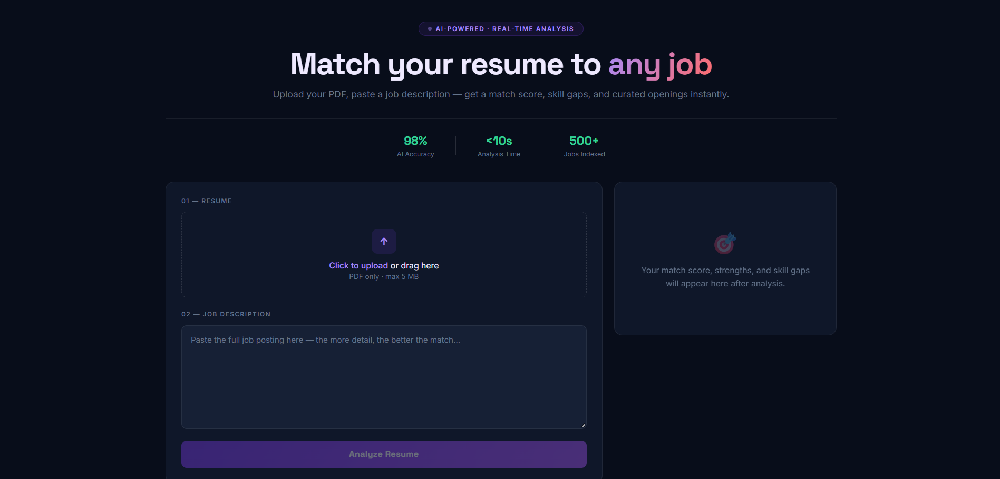

# 🚀 AI-Powered Resume Matcher & Job Aggregator

An AI-powered full-stack web application that analyzes resumes against job descriptions, calculates ATS compatibility, identifies missing skills, rewrites resumes for better ATS performance, and recommends relevant remote jobs based on the candidate's skill set.

---

## 📌 Overview

The AI-Powered Resume Matcher helps job seekers optimize their resumes and discover suitable job opportunities in one place.

Users can:
- Upload their resume (PDF)
- Paste a job description
- Get an AI-generated compatibility analysis
- Identify missing skills and strengths
- Rewrite their resume for improved ATS performance
- View matching remote jobs based on extracted skills

---

## ✨ Features

### 📄 Resume Upload
- Upload resume in PDF format
- Extract resume text using PDF parsing

### 🤖 AI Resume Analysis
- Compare resume with job description
- Generate ATS match percentage
- Identify missing skills
- Highlight candidate strengths
- Extract technical skills automatically

### ⭐ AI Resume Rewrite
- Rewrite resume professionally
- Improve ATS friendliness
- Enhance summary and project descriptions
- Optimize wording using AI

### 💼 Smart Job Aggregation
- Fetch remote jobs using the Remotive API
- Recommend jobs based on extracted resume skills
- Direct Apply links

### 🎨 Modern User Interface
- Glassmorphism UI
- Responsive layout
- Clean and professional design

---

## 🛠 Tech Stack

### Frontend
- React.js
- JavaScript
- HTML5
- CSS3

### Backend
- Node.js
- Express.js

### AI Integration
- Groq API (LLM)

### APIs
- Remotive Job API

### Libraries
- Multer
- PDF-Parse
- Axios
- CORS
- Dotenv

### Version Control
- Git
- GitHub

---

## 📂 Project Structure

```
AI-Powered-Resume-Matcher
│
├── backend
│   ├── uploads
│   ├── index.js
│   ├── package.json
│   └── .env
│
├── resume-matcher
│   ├── public
│   ├── src
│   │   ├── App.js
│   │   ├── App.css
│   │   └── ...
│   └── package.json
│
└── README.md
```

---

## ⚙️ Installation

### Clone Repository

```bash
git clone https://github.com/omkargaikwaddev/AI-Powered-Resume-Matcher.git
```

### Install Backend

```bash
cd backend
npm install
```

### Install Frontend

```bash
cd ../resume-matcher
npm install
```

---

## 🔑 Environment Variables

Create a `.env` file inside the `backend` folder.

```env
GROQ_API_KEY=YOUR_GROQ_API_KEY
```

---

## ▶️ Run Backend

```bash
cd backend
node index.js
```

Runs on:

```
http://localhost:5000
```

---

## ▶️ Run Frontend

```bash
cd resume-matcher
npm start
```

Runs on:

```
http://localhost:3000
```

---

## 🔄 Workflow

1. User uploads a PDF resume.
2. Resume text is extracted using **pdf-parse**.
3. User pastes a job description.
4. AI compares the resume with the job description.
5. The application generates:
   - ATS Match Percentage
   - Missing Skills
   - Strengths
   - Extracted Skills
6. Extracted skills are used to fetch matching jobs from the Remotive API.
7. Users can rewrite their resume with one click using AI.

---

## 📸 Screenshots

### Home Page



### Resume Analysis


### Job Recommendations and Resume Rewrite


---

## 🚀 Future Enhancements

- User Authentication (JWT)
- Resume History
- Company-wise Job Recommendations
- Resume Version Management
- Cover Letter Generator
- AI Interview Questions
- Resume Download as PDF
- Resume Templates
- Dashboard & Analytics
- Deployment (Render + Vercel)

---

## 🎯 Learning Outcomes

- Full Stack Development
- REST API Design
- AI API Integration
- Resume Parsing
- Prompt Engineering
- File Upload Handling
- Job API Integration
- State Management in React
- Express Backend Development
- Git & GitHub Workflow

---

## 👨‍💻 Author

**Omkar Gaikwad**

Computer Engineering Student

GitHub: https://github.com/omkargaikwaddev

---

## ⭐ If you found this project useful, consider giving it a Star!
